<!-- ================= HEADER TITLE ================= -->
<h1 align="center">
  <a href="https://eagleanurag.github.io/" target="_blank">eagleanurag</a>
</h1>

<!-- ================= STATUS BADGES ================= -->
<p align="center">
  
  
  
  
</p>

<!-- ================= HERO RIGHT GIF ================= -->


<!-- ================= INTRO SECTION ================= -->
### Hello 👋, I'm [Anurag Pandey](https://eagleanurag.github.io) & Google me as [eagleanurag](https://www.google.com/search?q=eagleanurag)

<!-- ================= SOCIAL ICONS ================= -->
<p>
<a href="https://www.linkedin.com/in/eagleanurag" target="_blank">  </a>
<a href="https://www.facebook.com/eagleanurag" target="_blank"></a>
<a href="https://www.instagram.com/eagleanurag" target="_blank"></a>
<a href="https://open.spotify.com/user/11147618695?si=zZFn6uAGRLyoU02lsG50GA" target="_blank"></a>
<a href="https://www.codewars.com/users/eagleanurag" target="_blank">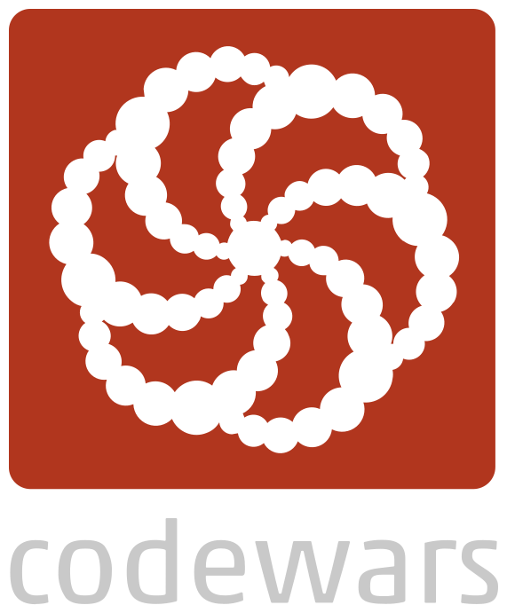</a>
<a href="https://www.codingame.com/profile/452b06c872f9773a58e7abff97b738a98661992" target="_blank"></a> 
<a href="https://www.instructables.com/member/eagleanurag/" target="_blank">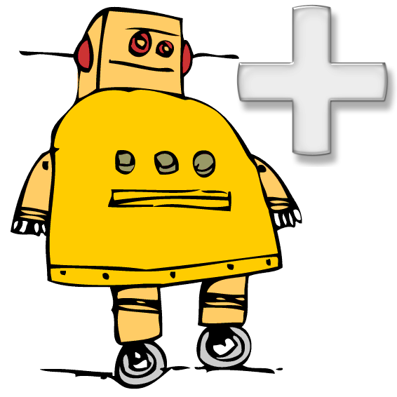</a> 
<a href="https://www.robotshop.com/community/user/eagleanurag" target="_blank">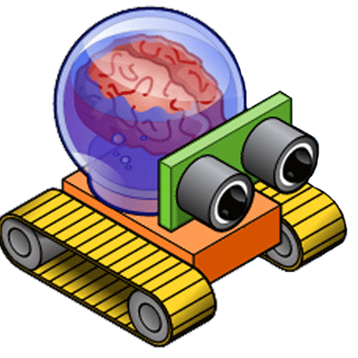</a> 
</p>

<div style="clear: both;"></div>
<br /> <br />

<!-- ================= PROFILE SUMMARY ================= -->
I'm currently working as a **Data Engineer** [🏢@KPMG](https://kpmg.com/in/en.html). <br />
Previously an **Electrical Engineering Graduate ⚡ / Researcher 🤿 [@eagleanurag](https://www.eagleanurag.blogspot.com)**  <br />
I enjoy building **real-world engineering, robotics, drone and data-driven**  📢 [@projects](https://instagram.com/eagleanurag).  <br />
and I’m passionate about interdisciplinary research combining **Data, AI, Embedded Systems and Aerospace technologies**. <br />


<!-- ================= MISC SECTION ================= -->
**Miscellaneous:**
- I’m currently exploring **Data Engineering, Distributed Systems, AI integration and Scalable Architectures** [📖](https://www.credly.com/users/eagleanurag)
- 🤹🏽 Fields I enjoy the most (Specialization Certifications) :
  - 🤖 [Robotics](https://coursera.org/share/a237c8f82d157c1a3c5cd601e1da855f) 
  - 🚜 [Self Drivng Car](https://coursera.org/share/402fe3487673e5484084007a7bb66602)
  - 🎛  [Embedded Systems](https://coursera.org/share/d6b710bd5043dc3297f2f40473d0d4e1)
  - 🖼 [Computer Vision](https://coursera.org/share/60f858b3923d6089999b77303599f758)
  - 🛩️ [FPV Drones & UAV]()
  - 🛠 [DIY IoT](https://coursera.org/share/6db505a2616af40dca190c56600b7e13)
- 📈 I’m currently learning **Life, Advanced Cloud Architectures and Research Methodologies**
- 💬 Ask me about **Engineering Projects, Data Systems, Robotics, Drones, Research and Open-Source**
- ⚡️ Fun-Fact: Enjoy the Joy.
- 📫 How to reach me: <helpmeinproject@gmail.com>
- 📝[Resume](https://www.google.com/search?q=eagleanurag)
 
  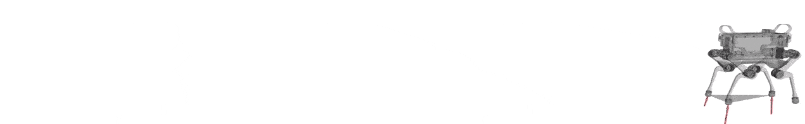

<!-- ================= CERTIFICATIONS SECTION ================= -->
 # 🏅 Earned Certifications & Badges

<!-- ================= AZURE ================= -->
<details open>
<summary><b>☁️ Microsoft Azure Certifications (7)</b></summary>

<p align="center">

<a href="https://www.credly.com/badges/8e3de632-3a06-47b2-816a-aaa74a0e9808/public_url"></a>
<a href="https://www.credly.com/badges/e24303ce-38b6-4342-b698-656857e75d95/public_url"></a>
<a href="https://www.credly.com/badges/ab994c7e-ba85-431e-8b31-ea0be0d64b8a/public_url"></a>
<a href="https://www.credly.com/badges/455c139c-3305-4e75-978a-c98d0f391172/public_url"></a>
<a href="https://www.credly.com/badges/8f049faf-270a-421c-aaaf-8b9842743cd4/public_url"></a>
<a href="https://www.credly.com/badges/4f4c394b-4e26-4bde-8343-a9d3bfabc1aa/public_url"></a>
<a href="https://www.credly.com/badges/66ddea1d-8590-4c2b-ba2c-d4f6b3b494eb/public_url">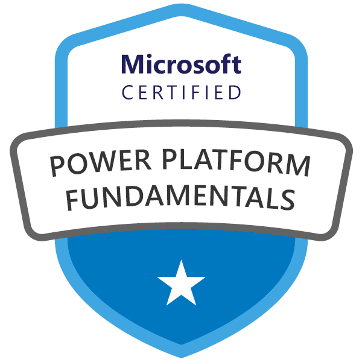</a>

</p>
</details>

---

<!-- ================= DATA / DEVOPS ================= -->
<details>
<summary><b>📊 Data Engineering / Platform / DevOps (6)</b></summary>

<p align="center">

<a href="https://www.credly.com/badges/02760ca9-77fb-45b4-997b-c7186f3842a0/public_url">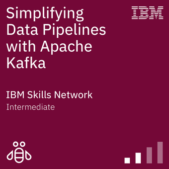</a>
<a href="https://www.credly.com/badges/8bb4fa4e-d64f-4990-857f-53f9fc75ccf7/public_url">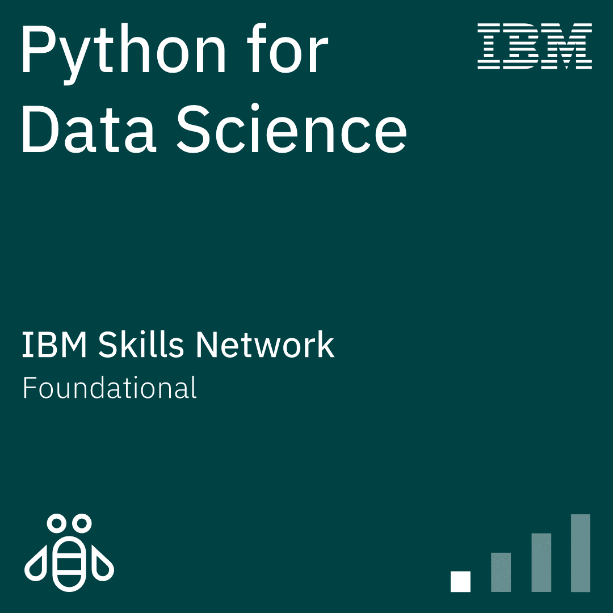</a>
<a href="https://www.credly.com/badges/c058b97b-ca08-4726-9d6e-d299e9bec67f/public_url"></a>
<a href="https://www.credly.com/badges/cf5c0340-2dce-47a3-9738-1fa0838be45c/public_url"></a>
<a href="https://www.credly.com/badges/2c3183f4-70e1-4546-98b0-afc71b906633/public_url"></a>
<a href="https://www.credly.com/badges/59fa0e80-7578-4d21-8e59-e1c22b49e8d3/public_url">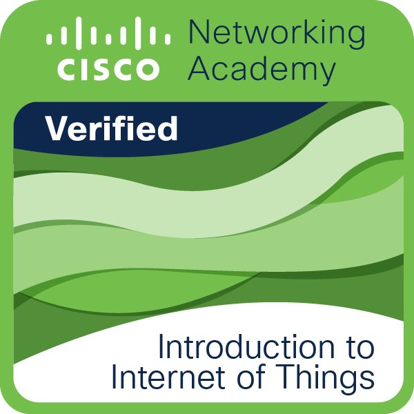</a>

</p>
</details>

---

<!-- ================= CLOUD FOUNDATIONS ================= -->
<details>
<summary><b>☁️ Cloud / Foundations (5)</b></summary>

<p align="center">

<a href="https://www.credly.com/badges/d9de376f-7d21-458d-8209-24c3334dfe14/public_url">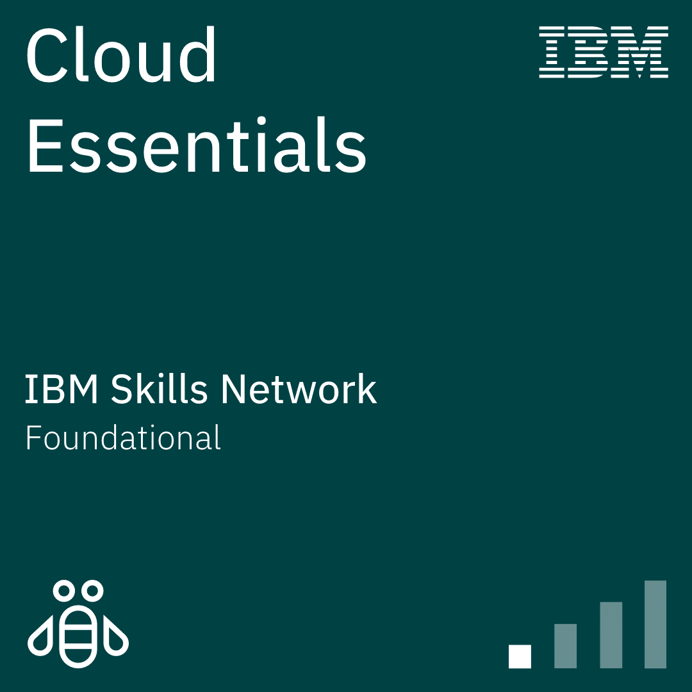</a>
<a href="https://www.credly.com/badges/7cd299ca-e72d-4358-8407-488a60991361/public_url">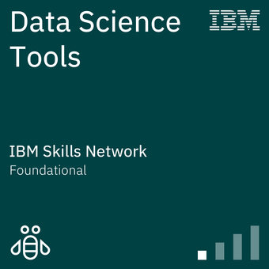</a>
<a href="https://www.credly.com/badges/a28306ed-b769-4eb8-9c6b-6797753bc568/public_url">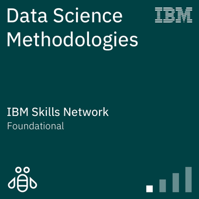</a>
<a href="https://www.credly.com/badges/f2b831c2-4ef9-498a-b7d2-18f812ed7f1d/public_url"></a>
<a href="https://www.credly.com/badges/fe90e45e-4a08-49a4-b3ed-4b76e39ab4e0/public_url">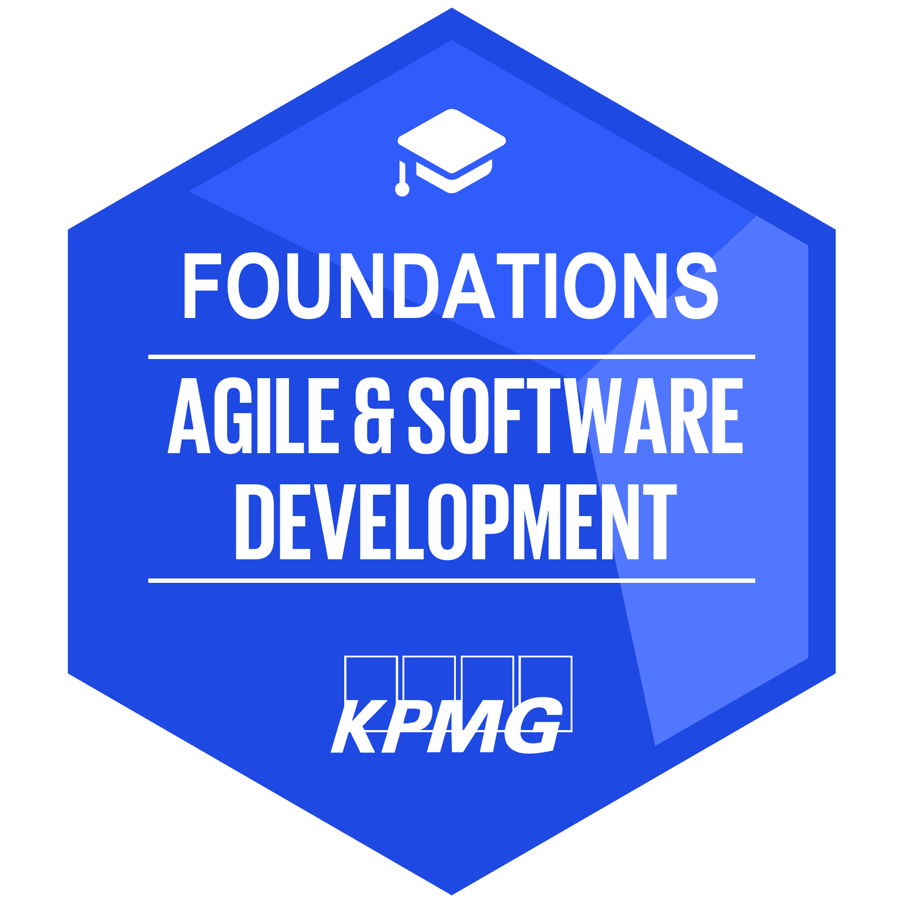</a>

</p>
</details>

---

<!-- ================= OTHER ================= -->
<details>
<summary><b>🎓 Other Certifications (5)</b></summary>

<p align="left">

<a href="https://www.credly.com/badges/cde20978-769f-45dd-9b43-7ffbfb12c847/public_url"></a>
<a href="https://www.credly.com/badges/22f2f380-ccc6-4a27-a12a-1f226dddd11f/public_url">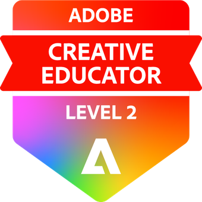</a>
<a href="https://www.credly.com/badges/0cf881b3-661f-443b-bd50-7e78773a7388/public_url"></a>
<a href="https://www.credly.com/badges/0dc41ae0-ea23-42fc-a6de-df2d3b70d513/public_url"></a>
<a href="https://www.credly.com/badges/eed88263-1cd5-4859-8380-a5d5c959bbf8/public_url"></a>

</p>
</details>

<!-- ================= RECENT ACTIVITY ================= -->
### :zap: Recent Activity

<!--START_SECTION:activity-->
1. 🔒 Closed issue [#7](https://github.com/eagleanurag/eagleanurag/issues/7) in [eagleanurag/eagleanurag](https://github.com/eagleanurag/eagleanurag)
2. 🔒 Closed issue [#6](https://github.com/eagleanurag/eagleanurag/issues/6) in [eagleanurag/eagleanurag](https://github.com/eagleanurag/eagleanurag)
3. 🔒 Closed issue [#5](https://github.com/eagleanurag/eagleanurag/issues/5) in [eagleanurag/eagleanurag](https://github.com/eagleanurag/eagleanurag)
4. 🔒 Closed issue [#6](https://github.com/eagleanurag/eagleanurag/issues/6) in [eagleanurag/eagleanurag](https://github.com/eagleanurag/eagleanurag)
5. 🔒 Closed issue [#7](https://github.com/eagleanurag/eagleanurag/issues/7) in [eagleanurag/eagleanurag](https://github.com/eagleanurag/eagleanurag)
<!--END_SECTION:activity-->

</a>
<a href="https://coursera.org/share/161ae3ce943f2ef62458cb811910ff07" target="_blank">
  
</a>

<!-- ================= GITHUB STATS ================= -->
<!--START_SECTION:waka-->
**🐱 My Github Data** 

> 🏆 139 Contributions in the Year 2021
 > 
> 📦 127.7 kB Used in Github's Storage 
 > 
> 💼 Opted to Hire
 > 
> 📜 63 Public Repositories 
 > 
> 🔑 2 Private Repositories  
 > 
**I'm an Early 🐤** 

```text
🌞 Morning    59 commits     ███░░░░░░░░░░░░░░░░░░░░░░   15.17% 
🌆 Daytime    209 commits    █████████████░░░░░░░░░░░░   53.73% 
🌃 Evening    77 commits     █████░░░░░░░░░░░░░░░░░░░░   19.79% 
🌙 Night      44 commits     ██░░░░░░░░░░░░░░░░░░░░░░░   11.31%

```
📅 **I'm Most Productive on Tuesday** 

```text
Monday       5 commits      ░░░░░░░░░░░░░░░░░░░░░░░░░   1.29% 
Tuesday      115 commits    ███████░░░░░░░░░░░░░░░░░░   29.56% 
Wednesday    70 commits     ████░░░░░░░░░░░░░░░░░░░░░   17.99% 
Thursday     36 commits     ██░░░░░░░░░░░░░░░░░░░░░░░   9.25% 
Friday       100 commits    ██████░░░░░░░░░░░░░░░░░░░   25.71% 
Saturday     39 commits     ██░░░░░░░░░░░░░░░░░░░░░░░   10.03% 
Sunday       24 commits     █░░░░░░░░░░░░░░░░░░░░░░░░   6.17%

```


📊 **This Week I Spent My Time On** 

```text
⌚︎ Time Zone: Asia/Kolkata

💬 Programming Languages: 
No Activity Tracked This Week

🔥 Editors: 
No Activity Tracked This Week

🐱‍💻 Projects: 
No Activity Tracked This Week

💻 Operating System: 
No Activity Tracked This Week

```

**I Mostly Code in C++** 

```text
C++                      2 repos             █████░░░░░░░░░░░░░░░░░░░░   22.22% 
HTML                     2 repos             █████░░░░░░░░░░░░░░░░░░░░   22.22% 
Python                   2 repos             █████░░░░░░░░░░░░░░░░░░░░   22.22% 
JavaScript               1 repo              ██░░░░░░░░░░░░░░░░░░░░░░░   11.11% 
Ruby                     1 repo              ██░░░░░░░░░░░░░░░░░░░░░░░   11.11%

```


<!--END_SECTION:waka-->


<!-- ================= SUPPORT / FOOTER ================= -->
**I Love Robots,** <code></code> **and they too love me!**


<p align="center">
<a href="https://www.buymeacoffee.com/eagleanurag" target="_blank"></a>
</p>


  


***<details><summary>Click Me For Little More Magical Words!</summary>***

  So from the very beginning, I was a bit passionate about robotics related stuff 
  and always wanted to be an Engineer in Defence Services. I love Drones and UAV, 
  as flying FPV Racing Drones is my Hobby. I remember I made nearly hundreds of 
  Electronics, Electrical, Programming, Robotics, Mechanical subjects based projects
  from myself and also for Final Year Students of Engineering. 

  Professionally I-m good in Arduino Programming and Open-Source Hardware Development. 
  Familiar with the electrical system of two/four-wheel Vehicle. Being FPV pilot I know
  about Drone-UAV Design, Manufacturing and Aeromodeling.

  -----


<br>
<table width="100%">
<tr>
<td width="33%" align="center">

</td>
<td width="33%" align="center">

</td>
<td width="33%" align="center">

</td>
</tr>
</table>

</details>

</details>


